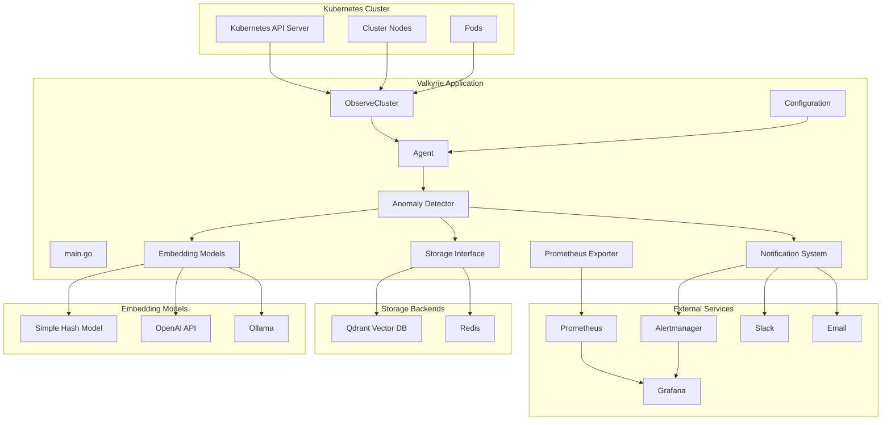

# Valkyrie Architecture

## System Overview

Valkyrie is an intelligent Kubernetes monitoring agent that uses reinforcement learning and anomaly detection to monitor cluster health and respond to issues.

## Architecture Diagram



## Component Details

### Core Components

1. **Agent** - Main orchestrator coordinating all activities
2. **Configuration** - YAML-based configuration management
3. **Cluster Observer** - Collects real-time Kubernetes data
4. **Anomaly Detector** - Identifies abnormal patterns using configurable EWMA smoothing
5. **Embedding Models** - Converts anomalies to vectors
6. **Storage Interface** - Manages alert and vector storage
7. **Notification System** - Distributes alerts to channels
8. **Prometheus Exporter** - Exports metrics for monitoring

### EWMA Alpha Tuning

The anomaly detection uses Exponential Weighted Moving Average (EWMA) with configurable alpha values:
- **Higher alpha (0.5-0.8)**: Faster reaction to changes, more sensitive to anomalies
- **Lower alpha (0.1-0.3)**: Slower reaction, more smoothing, less noise
- **Default alpha (0.3)**: Balanced approach for most monitoring scenarios

### Data Flow

1. **Observation** (30s intervals): Kubernetes → Agent
2. **Learning**: Cluster State → Historical Observations
3. **Detection**: State → Anomalies → Vector Storage
4. **Notification**: Anomalies → External Channels
5. **Metrics**: State → Prometheus → Grafana

## Configuration

Supports configuration for:
- Kubernetes connection and resources
- Anomaly detection thresholds and EWMA smoothing factors (alpha values)
- Storage backends (Qdrant/Redis)
- Embedding models (Simple/OpenAI/Ollama)
- Notification channels (Slack/Email/Webhook/Alertmanager)

## Deployment

### Local Development
```bash
go build -o valkyrie
./valkyrie -config config.yaml
```

### Docker Deployment
```bash
docker build -t valkyrie .
docker run -v $(pwd)/config.yaml:/app/config.yaml valkyrie
```

### Kubernetes Deployment
- Deploy as a DaemonSet for cluster-wide monitoring
- Use ConfigMap for configuration
- Integrate with existing monitoring stack

## Monitoring Stack Integration

Valkyrie integrates with a complete monitoring stack:
- **Prometheus**: Metrics collection and storage
- **Grafana**: Visualization and dashboards
- **Alertmanager**: Alert routing and management

The monitoring stack is defined in `docker-compose.yml` for easy local development and testing. 