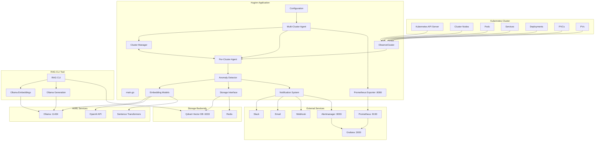

# Huginn Architecture

## System Overview

Huginn is an intelligent Kubernetes monitoring agent that uses reinforcement learning and anomaly detection to monitor cluster health and respond to issues. It provides comprehensive monitoring with configurable resource collection, statistical anomaly detection, and integration with modern AI/ML tools.

## Architecture Diagram



## Component Details

### Core Components

1. **Multi-Cluster Agent** - Coordinates multiple per-cluster agents, aggregates results, shares metrics exporter
2. **Cluster Manager** - Tracks per-cluster state and health, provides multi-cluster summaries
3. **Per-Cluster Agent** - Orchestrates observation, learning, detection for a single cluster
4. **Configuration** - YAML-based configuration management with comprehensive defaults
5. **Cluster Observer** - Collects real-time Kubernetes data with configurable resource types
6. **Anomaly Detector** - Identifies abnormal patterns using configurable EWMA smoothing and statistical analysis
7. **Embedding Models** - Converts anomalies to vectors (Simple, OpenAI, Ollama, Sentence Transformers)
8. **Storage Interface** - Manages alert and vector storage (Qdrant, Redis)
9. **Notification System** - Distributes alerts to multiple channels (Slack, Email, Webhook, Alertmanager)
10. **Prometheus Exporter** - Exports metrics for monitoring with resource-based metric creation

### New Features

#### 1. **Configurable Resource Collection**
- **Nodes**: CPU/memory usage, capacity, conditions, namespace mapping
- **Pods**: Status, restart counts, node assignment
- **Services**: Type and configuration
- **Deployments**: Replica counts and status
- **PersistentVolumeClaims (PVCs)**: Status, storage class, requested capacity
- **PersistentVolumes (PVs)**: Status, capacity, class, claim binding
- **Events**: Cluster events with severity, reason, and message analysis
- **Namespace Mapping**: Always collects namespace information for nodes regardless of pod monitoring

#### 2. **Enhanced Anomaly Detection**
- **Statistical Analysis**: Z-score, EWMA deviation, minimum standard deviation thresholds
- **Configurable Alpha Values**: EWMA smoothing factors for different metrics
- **Minimum History Requirements**: Ensures sufficient data before statistical analysis
- **Namespace Context**: Anomaly descriptions include namespace information
- **Event-Based Detection**: Identifies problematic cluster events (errors, warnings, specific failure types)

#### 3. **Command Line Interface**
- **Print Control Flags**: `-print-anomalies` and `-print-state` flags for output control
- **Configuration Flag**: `-config` for custom configuration files
- **Configuration Preview**: `-print-config` to dump the effective configuration (includes defaults)
- **Signal Handling**: Graceful shutdown with SIGINT/SIGTERM

#### 4. **RAG CLI Tool**
- **Document Management**: Add, search, and retrieve documents
- **Vector Storage**: Qdrant integration for similarity search
- **LLM Integration**: Ollama for embeddings and text generation
- **Interactive Mode**: Chat-like interface for easy interaction
- **Docker Integration**: Complete stack with monitoring services

### EWMA Alpha Tuning

The anomaly detection uses Exponential Weighted Moving Average (EWMA) with configurable alpha values:
- **Higher alpha (0.5-0.8)**: Faster reaction to changes, more sensitive to anomalies
- **Lower alpha (0.1-0.3)**: Slower reaction, more smoothing, less noise
- **Default alpha (0.3)**: Balanced approach for most monitoring scenarios (applied if not set)
- Note: You can override per metric via `cpuAlpha`, `memoryAlpha`, and `restartAlpha`.

### Statistical Analysis Configuration

The detector uses conservative, history-aware checks:
- **minStdDev**: Minimum standard deviation required for statistical analysis (default: 1.0)
- **Minimum history**: Nodes require 5 observations; pod restarts require 3
- **Z-score condition**: z-score > 4 AND value > 80% of threshold
- **Absolute condition**: value > threshold
- **EWMA deviation condition**: |value − EWMA| > max(3×stddev, 5.0) AND value > 70% of threshold

### Data Flow

1. **Observation** (30s intervals): Kubernetes → Agent
2. **Namespace Mapping**: Always collects pod-to-node mapping for namespace information
3. **Event Collection**: Gathers cluster events for anomaly detection and monitoring
4. **Learning**: Cluster State → Historical Observations
5. **Detection**: State → Anomalies → Vector Storage
6. **Notification**: Anomalies → External Channels
7. **Metrics**: State → Prometheus → Grafana

## Configuration

### Multi-Cluster Configuration
```yaml
observationInterval: 30
clusters:
  - name: "production"
    id: "prod-cluster-1"
    kubeconfig: "/path/to/prod-kubeconfig"
    context: "prod-context"
    namespace: ""
    resources:
      - nodes
      - events
      - pods
      - services
      # - persistentvolumeclaims
      # - persistentvolumes
    enabled: true
```

### Anomaly Detection Configuration
```yaml
anomalyDetection:
  cpuThreshold: 80.0
  memoryThreshold: 80.0
  podRestartThreshold: 3
  maxHistorySize: 1000
  cpuAlpha: 0.015        # EWMA smoothing factor
  memoryAlpha: 0.015     # EWMA smoothing factor
  restartAlpha: 0.015    # EWMA smoothing factor
  minStdDev: 1.0         # Minimum standard deviation used in stats
```

### Embedding Configuration
```yaml
embedding:
  type: simple           # simple, openai, ollama, sentence-transformers
  dimension: 384
  openai:
    apiKey: ""
    model: text-embedding-ada-002
  ollama:
    url: http://localhost:11434
    model: nomic-embed-text
  sentenceTransformers:
    model: all-MiniLM-L6-v2
    device: cpu
```

### Formatting Configuration
```yaml
formatting:
  # Console display (Go template). Safe accessors are available in code.
  anomalyDisplayTemplate: "Cluster {{.ClusterName}} [{{.Severity}}] {{.Type}} in {{.ResourceType}} resource {{.Resource}} in namespace {{.Namespace}}: {{.Description}}\n"

  # Single-line encoding template for vector storage
  anomalyEncodingTemplate: "Anomaly detected of type {{.Type}} in {{.ResourceType}} resource {{.Resource}} in namespace {{.Namespace}} in cluster {{.ClusterName}}: {{.Description}}"
```

Supported safe accessors: `.SafeClusterName`, `.SafeSeverity`, `.SafeType`, `.SafeResourceType`, `.SafeResource`, `.SafeNamespace`, `.SafeNodeName`, `.HasNodeName`. Template funcs: `default`, `nonEmpty`.

### Storage Configuration
```yaml
storage:
  type: qdrant           # qdrant, redis
  storeAlerts: false
  qdrant:
    url: http://localhost:6333
    collection: alerts
    vectorSize: 384
    distanceMetric: cosine
```

### Notification Configuration
```yaml
notification:
  enabled: true
  type: alertmanager     # slack, email, webhook, alertmanager
  minSeverity: warning
  alertmanager:
    url: http://localhost:9093/api/v1/alerts   # v1 endpoint expected (returns 200)
    labels:
      app: huginn
      severity: warning
```

## Deployment

### Local Development
```bash
go build -o huginn
./huginn -config config.yaml -print-anomalies -print-state
```

### Docker Deployment
```bash
docker build -t huginn .
docker run -v $(pwd)/config.yaml:/app/config.yaml huginn
```

### Kubernetes Deployment
- Deploy as a DaemonSet for cluster-wide monitoring
- Use ConfigMap for configuration
- Integrate with existing monitoring stack

## Monitoring Stack Integration

Huginn integrates with a complete monitoring stack:
- **Prometheus**: Metrics collection and storage (port 9190)
- **Grafana**: Visualization and dashboards (port 3000)
- **Alertmanager**: Alert routing and management (port 9093)
- **Qdrant**: Vector database for anomaly storage (port 6333)

### Service Ports
- **Huginn Metrics**: `:8080`
- **Prometheus**: `:9190`
- **Alertmanager**: `:9093`
- **Grafana**: `:3000`
- **Qdrant HTTP**: `:6333`
- **Qdrant gRPC**: `:6334`
- **Ollama**: `:11434`

### Resource-Based Metrics
**Important**: Prometheus metrics are only created for resources enabled in your `kubernetes.resources` configuration:

- **If `nodes` is enabled**: All node metrics (CPU, memory, capacity, statistics) are created
- **If `pods` is enabled**: All pod metrics (restart counts, statistics) are created
- **Always enabled metrics**: Anomaly detection metrics and historical data

Note: The multi-cluster agent exposes a single metrics server on `:8080` aggregating data across clusters.

## RAG CLI Tool

The RAG CLI tool provides LangChain-like functionality:
- **Document Storage**: Add documents to vector database
- **Similarity Search**: Find relevant documents using embeddings
- **Question Answering**: Generate responses using retrieved context
- **Interactive Mode**: Chat-like interface for easy interaction

### Quick Start with RAG CLI
```bash
cd scripts/ragcli
./start-stack.sh
./rag-cli -interactive
```

## Recent Updates

### Namespace Collection Enhancement
- **Always Active**: Namespace mapping works regardless of pod monitoring configuration
- **Efficient Collection**: Minimal pod data collection for node-to-namespace mapping
- **Enhanced Anomaly Context**: Anomaly descriptions include namespace information
- **Improved State Reporting**: Node state includes namespace distribution

### Event Collection Feature
- **Cluster Events**: Collects Kubernetes events for comprehensive monitoring
- **Event-Based Anomalies**: Detects problematic events (errors, warnings, specific failure types)
- **Event Filtering**: Identifies recurring issues and specific problematic event reasons
- **State Integration**: Events included in cluster state and anomaly detection

### Configuration Improvements
- **Comprehensive Defaults**: All configuration sections have sensible defaults
- **Alpha Value Tuning**: Configurable EWMA smoothing factors for different metrics
- **Statistical Thresholds**: Minimum standard deviation and history requirements
- **Resource Flexibility**: Configurable resource collection based on needs

### Monitoring Integration
- **Resource-Based Metrics**: Metrics only created for enabled resources
- **Statistical Measures**: Mean, standard deviation, and EWMA metrics
- **Anomaly Tracking**: Comprehensive anomaly detection metrics
- **Historical Data**: Metric history for trend analysis 